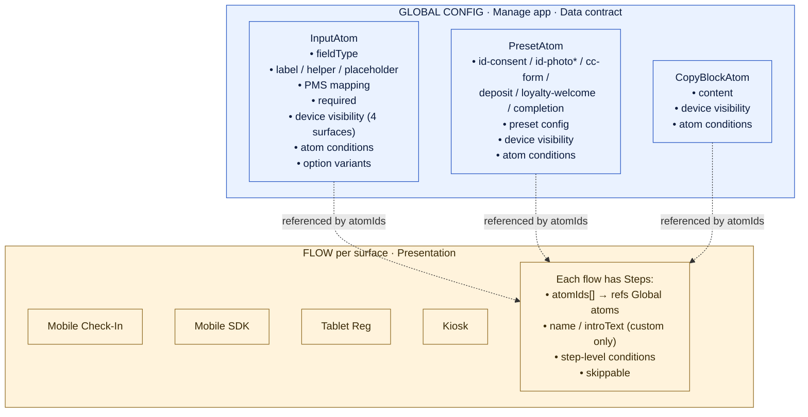
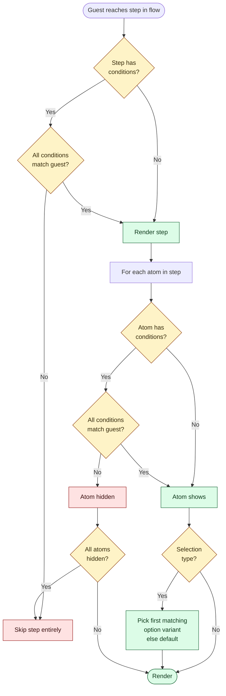
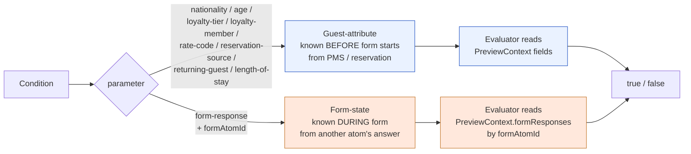
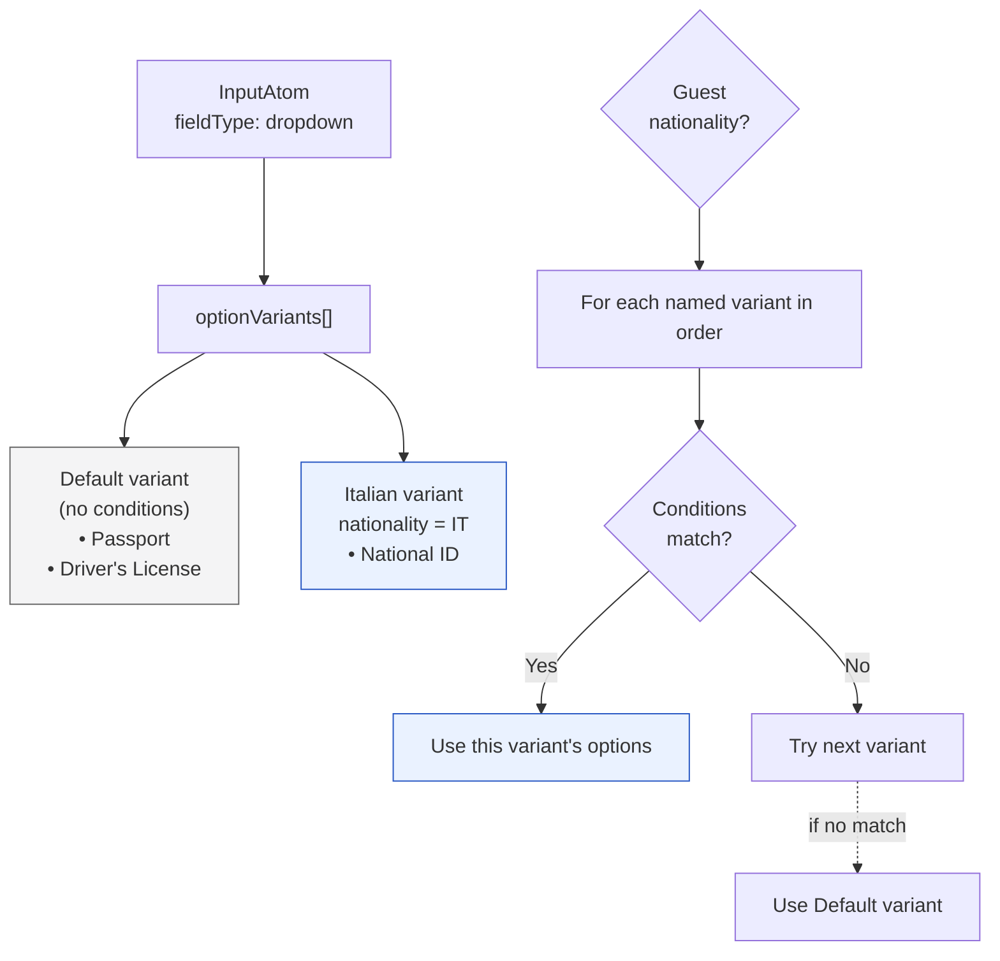

# Check-in Configurator — Mental Model

Visual reference for the two-layer architecture, condition evaluation, and authoring flow.
Renders natively in GitHub, VS Code, Obsidian, and at https://mermaid.live.

---

## Two layers — orthogonal, not cascade



**Rule:** Edit data + atom-level conditions in Global; edit composition + step-level UX copy + step-level gates in Flow. Flow can never override Global's data contract; Flow only chooses *whether* to include a step and *how* to compose atoms inside it.

---

## Conditions — layered evaluation, not cascading



**Step-level fires first.** If the step's gate fails, the whole page skips and atom evaluation never runs. If the step renders, atom-level filters individual atoms inside. Step doesn't *override* atom — they layer.

---

## Condition kinds — guest-attribute vs form-state



**Examples:**
- *Show this field only to Diamond loyalty members.* → guest-attribute (`loyalty-tier equals diamond-elite`)
- *Show pet-size only if pet=yes.* → form-state (`form-response, formAtomId=atom-pet, equals "yes"`)
- *Skip Pet Policy step if pet=no.* → step-level form-state condition
- *Italian guests get only National ID for ID Type.* → atom variant with guest-attribute condition

---

## Option variants — wholesale replacement, not additive



**Rule:** First matching named variant wins; otherwise the default variant. No union — options are *swapped*, not added. CS thinks "Italian guests see THIS list" not "Italian guests see extras."

---

## Authoring flow (CS workflow)

```mermaid
flowchart LR
  CS([CS opens<br/>configurator]) --> Tab{Configuration<br/>or Flows?}

  Tab -- Configuration --> ConfigUI[Pick atom domain<br/>→ click atom row<br/>→ right pane editor]
  Tab -- Flows --> FlowsUI[Pick surface flow<br/>→ click step<br/>→ step editor]

  ConfigUI --> EditAtom[Edit:<br/>• label / helper / placeholder<br/>• PMS mapping / required<br/>• Surface coverage<br/>• Options + variants<br/>• Atom conditions]

  FlowsUI --> EditFlow[Edit:<br/>• step name<br/>• step intro copy (custom only)<br/>• step-level conditions<br/>• atomIds composition<br/>• step order]

  EditAtom --> LivePreview[Right-pane GUEST PREVIEW<br/>updates as CS types]
  EditFlow --> FlowPreview[Phone preview shows<br/>step rendering with<br/>simulate-bar context controls]

  classDef cs fill:#FFF3DC,stroke:#926E27
  classDef out fill:#DCFCE7,stroke:#166534
  class ConfigUI,FlowsUI,EditAtom,EditFlow cs
  class LivePreview,FlowPreview out
```

---

## Architectural rules at a glance

| Rule | Implication |
|---|---|
| **Atoms are atomic** | No `Form` or `FieldGroup` registry in Global. Bundling = step composition in Flow. |
| **Atom-level conditions in Global** | Data-contract truth. Apply everywhere the atom is used, regardless of flow. |
| **Step-level conditions in Flow** | Composition truth. This Flow chooses to skip this step under X. |
| **Layered, not cascading** | Step gate → if pass, atom gates fire inside. Step doesn't override atom. |
| **Required is global only** | If a hotel needs the data, they need it on every surface that collects it. |
| **Device visibility = per-atom metadata** | NOT a condition parameter. Atom carries 4 booleans for the 4 surfaces. |
| **Conditions take guest attributes OR form responses** | Same condition primitive at both atom and step level. |
| **Variants replace, don't add** | First matching variant wins; default is the fallback. |
| **No 'web' surface** | The four real surfaces: Mobile Check-In · Mobile SDK · Tablet Registration · Kiosk. |
| **Custom steps own UX copy** | `step.introText` editable in Flow editor. Preset steps' copy lives on the preset atom. |

---

## File map (where each concept lives)

| Concept | File |
|---|---|
| Type definitions | `lib/products/check-in-flows/types.ts` |
| Condition evaluator | `lib/products/check-in-flows/condition-evaluator.ts` |
| Condition metadata (params, operators) | `lib/products/check-in-flows/condition-meta.ts` |
| Atom seed data | `lib/products/check-in-flows/default-atoms.ts` |
| Default flow generation | `lib/products/check-in-flows/default-flow-generator.ts` |
| Store (Zustand) | `lib/products/check-in-flows/store.ts` |
| Configuration tab page | `components/products/check-in-flows/CheckInConfigPage.tsx` |
| Atom detail editor | `components/products/check-in-flows/configuration/AtomDetailPane.tsx` |
| Atom row (left pane list) | `components/products/check-in-flows/configuration/AtomRow.tsx` |
| Options + variant editor | `components/products/check-in-flows/configuration/OptionsEditor.tsx` |
| Inline guest preview | `components/products/check-in-flows/configuration/AtomPreview.tsx` |
| Condition rule editor | `components/products/check-in-flows/editors/ConditionRuleEditor.tsx` |
| Atom slot editor in steps | `components/products/check-in-flows/editors/SchemaFormEditor.tsx` |
| Flow editor + step editor + browse | `components/products/check-in-flows/ConfiguratorShell.tsx` |
| Step rendering (preview) | `components/products/check-in-flows/preview/StepRenderer.tsx` |
| Reg-card preview rendering | `components/products/check-in-flows/preview/RegistrationCardPreview.tsx` |
| Preview context simulate bar | `components/products/check-in-flows/preview/PreviewContextSelector.tsx` |
